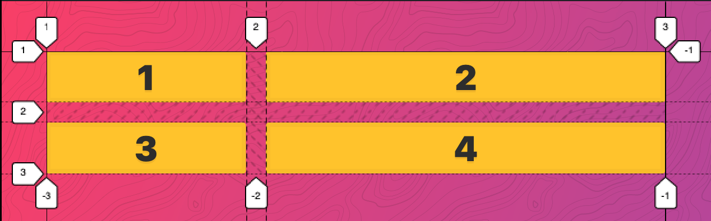
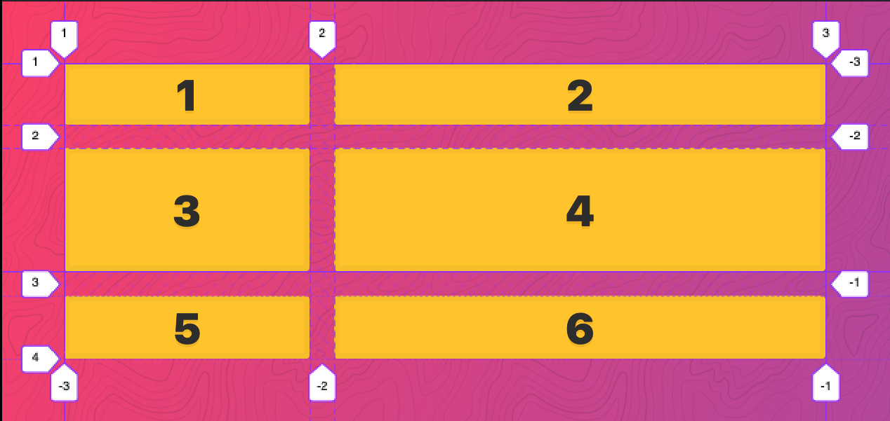
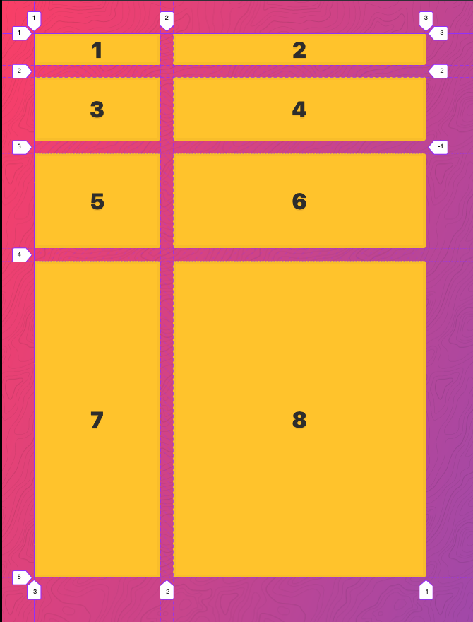

# CSS-Grid

see images for section 03|07 (12/01/2020)

notice `display: grid` shares properties with **Flexbox** like **justify-content**

| property              | value | desc   |
| :-------------------- | :---- | :----- |
| display               | grid  | layout |
| grid-template-columns |       |        |

```css
    .container {
      display: grid;
      grid-template-columns: 50px auto repeat(2, 100px);
      grid-template-rows: 200px repeat(3, 100px );
      gap: 20px;
    }
```

### CSS Grid Implicit vs Explicit Tracks

Rows and Columns you specifically define are Explicit. Those that are interperlated by the browser are Implicit. Explicit are shown in the dev tools with solid-lines show where the grid Explicit Grid stops and starts. Explicit Rows & Columns are shown as dark dashed-lines. Implicit Rows & Columns are shown as lighter dotted-lines.

```html
  <div class="container">
    <div class="item">1</div>
    <div class="item">2</div>
    <div class="item">3</div>
    <div class="item">4</div>
  </div>
```

```css
.container {
  display: grid;
  gap: 20px;
  grid-template-columns: 200px 400px;
  grid-template-rows: 50px 100px;
}
```



Add additional rows without accounting for them in CSS Grid - explicitly.  The browser then creates an implicit row for us.

CSS styles.css remains the same... just change HTML

```html
  <div class="container">
    <div class="item">1</div>
    <div class="item">2</div>
    <div class="item">3</div>
    <div class="item">4</div>
    <div class="item">5</div>
    <div class="item">6</div>
    <div class="item">7</div>
    <div class="item">8</div>
  </div>
```

Notice the browser has created an additional row with two columns and you can see in the dev-tools that they are lighter dotted-lines that appear after the solid-line that defines the explicit grid



### Size Implicit Grid Columns and Rows

All rows created will have height of 500px:

```css
  grid-auto-rows: 500px;
  ```

All rows created will have alternating heights of 150px and 500px:

```css
  grid-auto-rows: 150px 500px;
  ```



