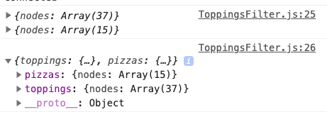
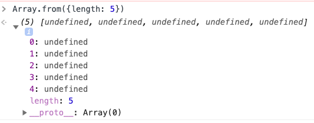
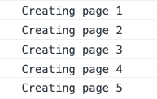

# JavaScript

## Wes Bos Hot Tips

### Console Log Multiple things more clearly

If you have more than one thing to console log, you can add clarity to the console by logging the names of each variable being logged -- log variables as an object...

```javascript
// log individual vars
  console.log(toppings, pizzas);
// log vars showing names of variables with accompaning output
  console.log({ toppings, pizzas });
```

**Console Output**:



### Constantly having to Clear the Console

Insert a `console.clear();`  command in your code just before you start logging so that console only shows your lastest logging.

```javascript
  // clear console before we start logging
  console.clear();
```

### Loop from 1 to n and do something for each

Create an **Array** of a **size** by using `Array.from()` and passing in an **Object** with a **length** property. This creates an array with length equal to the length property. For example: if we have a `{length: 5}` we get the following result.

```javascript
console.log(Array.from({ length: 5 }));
```



**Note**: the length value can come from anywhere (hard-coded, passed into function, set as variable, come from node environment variable, etc)

We can then loop over the **Array** we just created with `.forEach()`. Since the array has all elements set to **undefined** we can ignore it (often times devs use an `_` when ignoring a value). It is the **index** value that we are interested in. Therefore, the **arrow function** we pass to `.forEach()` contains `_` as a placeholder since the it is the second value passed that contains the **index** (the third and final value is the array itself which is usually not needed but is available just in case).

```javascript
console.log(
  Array.from({ length: 5 }).forEach((_, index) => {
    console.log(`Creating page ${index + 1}`);
  })
);
```



another example...

```javascript
const pageCount = 4;

Array.from({ length: pageCount }).forEach((_, idx) => {
  console.log(idx + 1);
});
```


