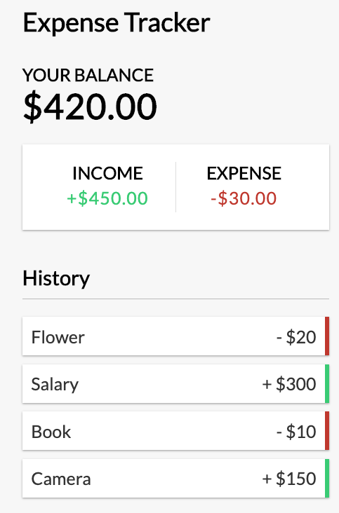

# 80-20 Guide to React

## Hooks

### Context API

#### Context with Reduce Function

**Use Case**
Calculate the ` Balance ` based on the amount values stored within the ` transactions ` using the **Context API** and the ` reduce() ` function.

```javascript
import React, {useContext} from 'react';
import {GlobalContext} from '../context/GlobalState';

export const Balance = () => {

  const {transactions} = useContext(GlobalContext);
  const balance = transactions.reduce((prev, curr) => {
    return prev + curr.amount;
  }, 0);

  return (
    <>
      <h4>Your Balance</h4>
      <h1>${balance.toFixed(2)}</h1>
    </>
  )
}
```


