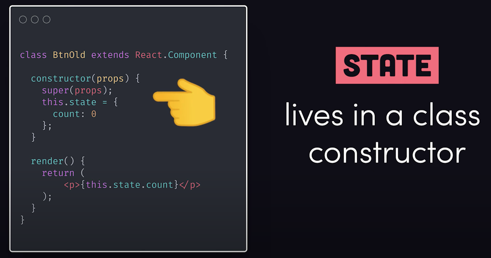

# 80-20 Guide to React

## React Hooks

[FireShip-Hooks-video](https://youtu.be/TNhaISOUy6Q)

React has 10 Built-in Hooks plus you can build your own from scratch:

### [Basic Hooks](https://reactjs.org/docs/hooks-reference.html#basic-hooks)

[useState](https://reactjs.org/docs/hooks-reference.html#usestate)

[useEffect](https://reactjs.org/docs/hooks-reference.html#useeffect)
[useContext](https://reactjs.org/docs/hooks-reference.html#usecontext)

### [Additional Hooks](https://reactjs.org/docs/hooks-reference.html#additional-hooks)

[useReducer](https://reactjs.org/docs/hooks-reference.html#usereducer)
[useCallback](https://reactjs.org/docs/hooks-reference.html#usecallback)
[useMemo](https://reactjs.org/docs/hooks-reference.html#usememo)
[useRef](https://reactjs.org/docs/hooks-reference.html#useref)
[useImperativeHandle](https://reactjs.org/docs/hooks-reference.html#useimperativehandle)
[useLayoutEffect](https://reactjs.org/docs/hooks-reference.html#uselayouteffect)
[useDebugValue](https://reactjs.org/docs/hooks-reference.html#usedebugvalue)

### Custom Hooks

### From Classes to Hooks

Before React 16.8, Classes were required to access certain functionality.

#### State

**State**  was title coupled to a  **Class-based Component**  and referenced in the  **Constructor**  

What you could end up with was a complex tree of nested components

