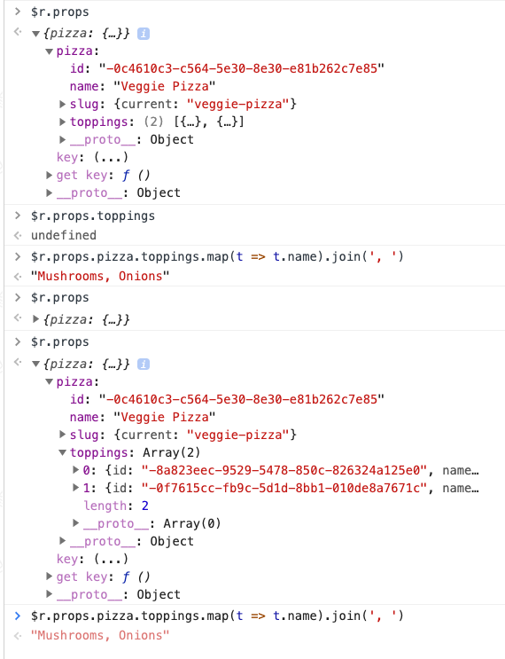

# React

## Wes Bos Hot Tips

### React | console | $r

When you have a React Component selected in React-Dev-Tools
- inspect on webpage and open the Components Tab belonging to React Dev Tools
- Go to Console and type **$r**

This gives you access to the React Component

Example:

